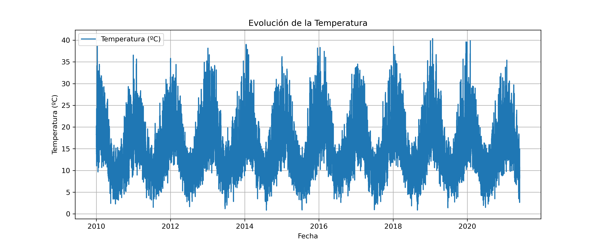
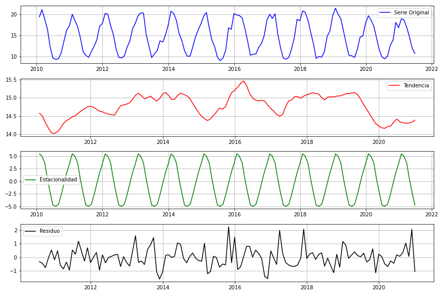
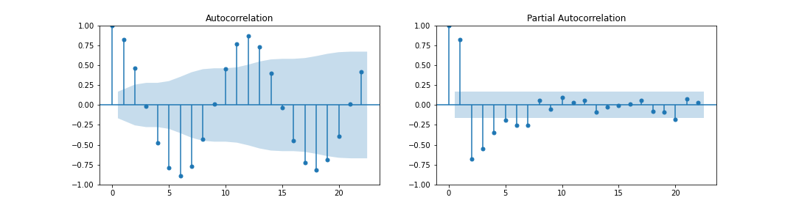
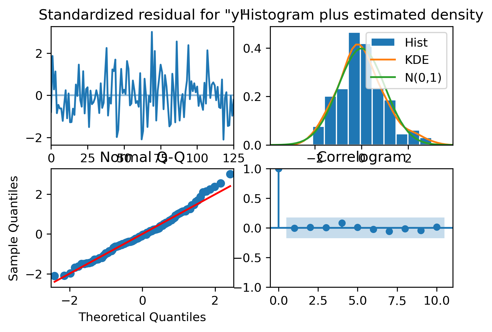
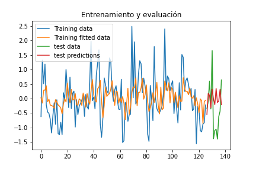

# Time Series Temperature Forecasting with ARIMA

Time series forecasting project focused on temperature prediction using statistical modeling and ARIMA-based analysis.

---

## Overview

This project explores time series analysis and forecasting using monthly temperature data collected in Australia between 2010 and 2021.

The workflow includes statistical analysis of the temporal series, stationarity verification, seasonal decomposition, ARIMA parameter selection, model validation, and future temperature forecasting.

Main components of the project include:

- Exploratory time series analysis
- Stationarity testing using Dickey-Fuller
- Trend and seasonality analysis
- Seasonal decomposition
- ARIMA parameter selection using ACF and PACF
- Residual diagnostics
- Future temperature forecasting

---

## Dataset

The project uses monthly average temperature data from Australia covering the period between 2010 and 2021.

Dataset characteristics:

- Monthly temporal resolution
- Continuous temperature measurements
- Seasonal behavior across years
- Time-dependent statistical structure

The dataset was used to:

- Analyze stationarity properties
- Study seasonality patterns
- Train ARIMA forecasting models
- Predict future temperature values

---

## Methodology

The workflow included the following stages:

1. Exploratory data analysis
2. Stationarity testing using Dickey-Fuller
3. Trend and seasonality analysis
4. Seasonal decomposition
5. ARIMA parameter selection using ACF and PACF
6. Model training and validation
7. Future forecasting

### Time Series Analysis

The analysis pipeline included:

- Distribution visualization
- Temporal evolution analysis
- Seasonal adjustment
- Residual analysis
- Forecast evaluation

---

## Model Architecture

The forecasting approach is based on:

- ARIMA statistical modeling
- Seasonal decomposition techniques
- Autocorrelation analysis

The final selected model was:

- ARIMA(3,0,2)

The model was evaluated using residual diagnostics and forecasting performance on unseen temporal data.

---

## Technologies

- Python
- Pandas
- NumPy
- Matplotlib
- Statsmodels
- Scikit-learn
- Google Colab
- Jupyter Notebook

---

## Evaluation Metrics

The model evaluation included:

- Residual analysis
- Autocorrelation analysis
- Forecast comparison
- Statistical stationarity verification

The analysis also focused on understanding how seasonality affects the stationarity and predictability of the temporal series.

---

## Results

### Original Time Series



---

### Seasonal Decomposition



---

### ACF and PACF Analysis



---

### Residual Diagnostics



---

### Forecasting Results



---

## Main Findings

- The temperature series showed strong yearly seasonality.
- No significant long-term trend was detected.
- Removing seasonality was sufficient to achieve stationarity.
- ARIMA(3,0,2) provided the best overall performance among the evaluated models.
- Forecasted temperature values followed realistic seasonal behavior consistent with previous years.

---

## Repository Structure

```text
notebooks/      -> analysis and forecasting notebooks
images/         -> figures and visual results
report/         -> project report
```

---

## Future Improvements

Possible extensions of this project include:

- Comparison with SARIMA and Prophet models
- Deep learning forecasting approaches using LSTM networks
- Hyperparameter optimization
- Multivariate time series forecasting
- Real-time weather forecasting pipelines

---

## Author

Ana Fuentes Rodríguez.   
BSc in Physics | MSc in Data Science and Computer Engineering
